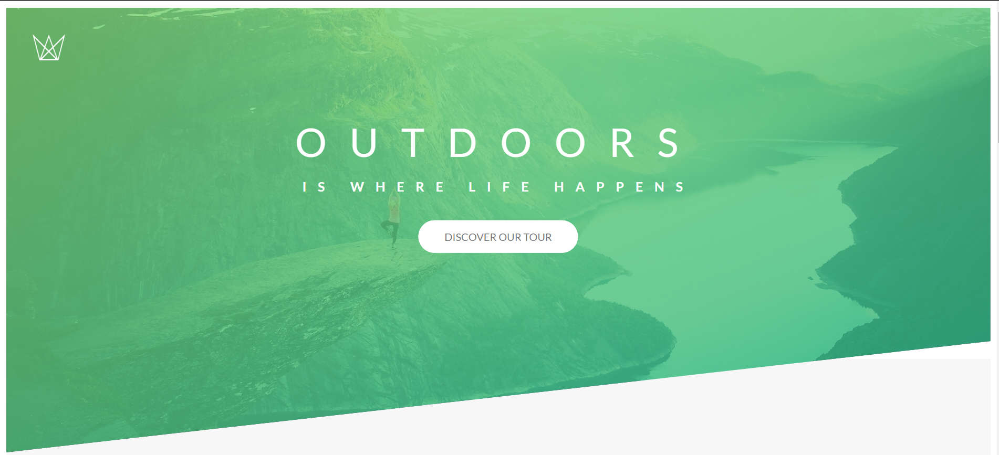
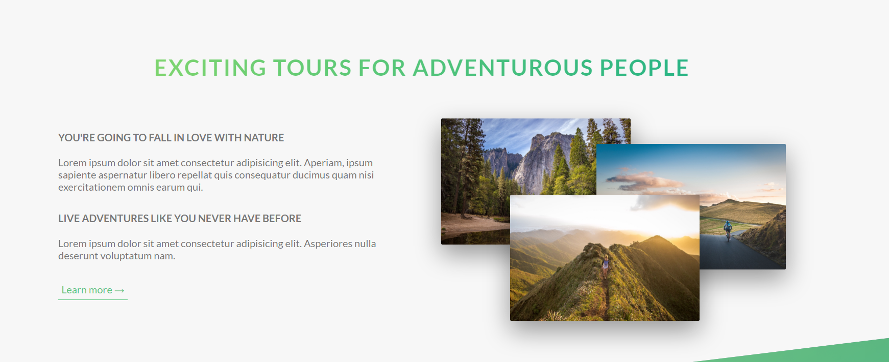
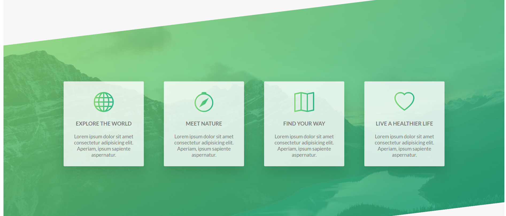

# 1) Header section



# Building a tour section
1. build amazing card, perspective in css, backface-visibility property
2. using bakground blend modes
3. how and when to use box-decoration-break.

```html
<header class="header">
      <!-- Logo box -->
      <div class="header__logo-box">
        
      </div>
      <!-- Text box -->
      <div class="header__text-box">
        <h1 class="heading-primary">
          <span class="heading-primary--main">Outdoors</span>
          <span class="heading-primary--sub">is Where life happens</span>
        </h1>

        <a href="#" class="btn btn--white btn--animated">Discover our tour</a>
      </div>
      <!-- Text box Ends -->
 </header>
```

```css
/* sass/layout/_header.scss */
.header {
  height: 95vh;
  /* background image with linear gradient and image */
  background-image: linear-gradient(to right bottom, rgba($color-primary-light, 0.8), rgba($color-primary-dark, 0.8)), url(../img/hero.jpg);
  background-size: cover;
  background-position: top;
  clip-path: polygon(0 0, 100% 0, 100% 75%, 0 100%); /* four line at clockwise direction */
  position: relative;

  &__logo-box {
    position: absolute;
    left: 4rem;
    top: 4rem;
  }

  &__logo {
    width: 5rem;
    height: 4rem;
  }

  &__text-box {
    position: absolute;
    top: 40%;
    left: 50%;
    transform: translate(-50%, -50%);
    text-align: center;
  }
} /* .header ends */

```

# About section 


```html
 <main>
      <section class="section-about">
        <div class="u-center-text u-margin-bottom-big">
          <h2 class="heading-secondary">Exciting tours for adventurous people</h2>
        </div>

        <div class="row">
          <div class="col-1-of-2">
            <h3 class="heading-tertiary u-margin-bottom-small">You're going to fall in love with nature</h3>
            <p class="paragraph">Lorem ipsum dolor sit amet consectetur adipisicing elit. Aperiam, ipsum sapiente aspernatur libero repellat quis consequatur ducimus quam nisi exercitationem omnis earum qui.</p>

            <h3 class="heading-tertiary u-margin-bottom-small">Live adventures like you never have before</h3>
            <p class="paragraph">Lorem ipsum dolor sit amet consectetur adipisicing elit. Asperiores nulla deserunt voluptatum nam.</p>
            <a href="#" class="btn-text">Learn more &rarr;</a>
          </div>

          <div class="col-1-of-2">
            <div class="composition">
              
              
              
            </div>
          </div>
        </div>
      </section>
```

```css
/* sass\pages\_home.scss */
.section-about {
  background-color: $color-grey-light-1;
  margin-top: -20vh;
  padding: 25rem 0;
}

/* sass\components\_composition.scss */
.composition {
  position: relative;

  &__photo {
    width: 55%;
    box-shadow: 0 1.5rem 4rem rgba($color-black, 0.4);/* only at a bottom */
    border-radius: 2px;
    position: absolute;
    z-index: 10;
    transition: all 0.2s;
    outline-offset: 2rem;

    &--p1 {
      left: 0;
      top: -2rem;
    }

    &--p2 {
      right: 0;
      top: 2rem;
    }

    &--p3 {
      left: 20%;
      top: 10rem;
    }

    &:hover {
      outline: 1.5rem solid $color-primary;  /* create green outline */
      transform: scale(1.05);
      box-shadow: 0 2.5rem 4rem rgba($color-black, 0.5); /* increase shadow at bottom */
      z-index: 20;
    }
  } // end of composition__photo

  &:hover &__photo:not(:hover) {
    transform: scale(0.95);/* photo that are not hover and scale down */
  }
} /* end of composition */
```

# 3) Features section


```html
  <section class="section-features">
        <div class="row">
          <div class="col-1-of-4">
            <div class="feature-box">
              <i class="feature-box__icon bi bi-globe"></i>
              <h3 class="heading-tertiary u-margin-bottom-small">Explore the world</h3>
              <p class="feature-box__text">Lorem ipsum dolor sit amet consectetur adipisicing elit. Aperiam, ipsum sapiente aspernatur.</p>
            </div>
            ....
       </div>
   <section>

```

```css
.feature-box {
  background-color: rgba($color-white, 0.8);
  font-size: 1.5rem; /* inherits to &__text; */
  box-shadow: 0 1.5rem 4rem rgba($color-black, 0.15);
  transition: transform 0.3s;

  &__icon {
    font-size: 6rem;
    margin-bottom: 2rem;
    display: inline-block;
    background-image: linear-gradient(to right, $color-primary-light, $color-primary-dark);
    -webkit-background-clip: text;
    background-clip: text; /* text is clip according to background */
    color: transparent;
  }

  &:hover {
    transform: translateY(-1.5rem) scale(1.03);
  }
}

```

# 4)Section tours
```html
 <div class="col-1-of-3">
     <div class="card">
         <div class="card__side card__side--front">
            Front
         </div>

      <div class="card__side card__side--back">
        Back
      </div>
  </div>

```

```css
.card {
  height: 50rem;
  transition: all 0.5s;
  /* persective have to be in parents components */
  perspective: 150rem;
  -moz-perspective: 150rem;
  position: relative;
  height: 50rem;

  &__side {
    height: 50rem;
    transition: all 0.8s ease;
    color: #fff;
    font-size: 2rem;
    position: absolute;
    top: 0;
    left: 0;
    width: 100%;
    /* if width not given then it will take contain width which is front and back */
    backface-visibility: hidden;

    &--front {
      background-color: white;
    }

    &--back {
      background-color: green;
      transform: rotateY(180deg);
    }
  }

  &:hover &__side--front {
    transform: rotateY(180deg); 
    /* left to right if rotateX then top to bottom */
  }

  &:hover &__side--back {
    transform: rotateY(0); 
    /* left to right */
  }
}


```